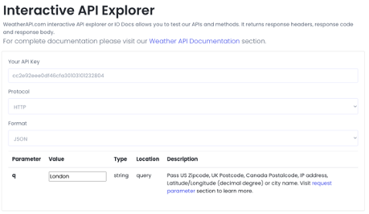
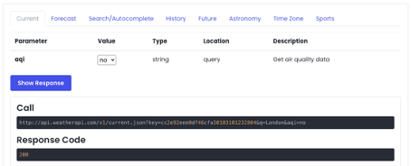
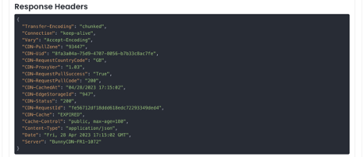
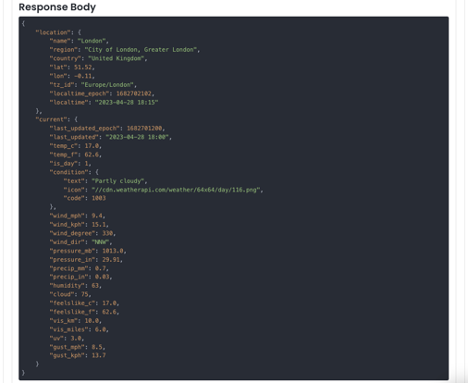
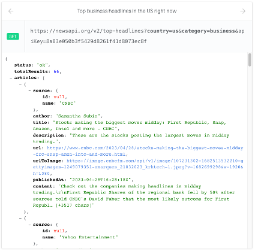
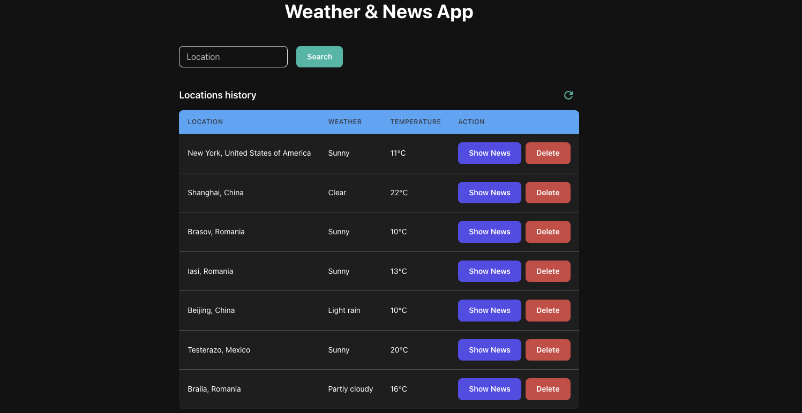
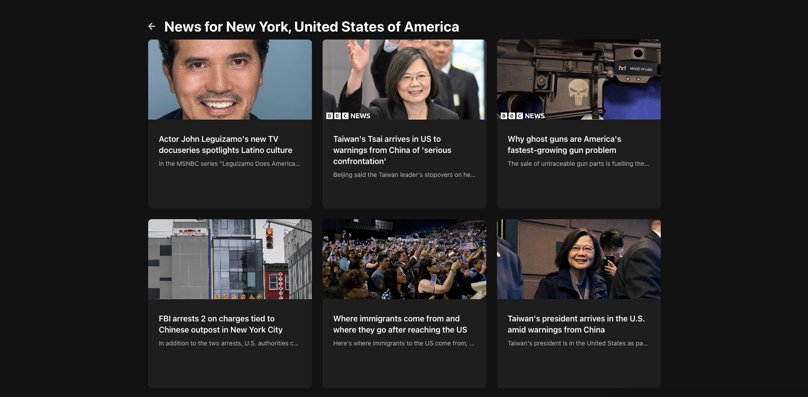
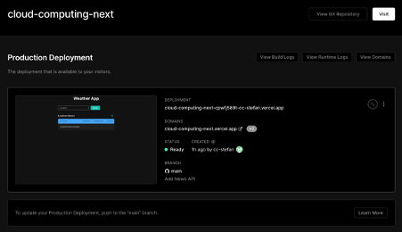
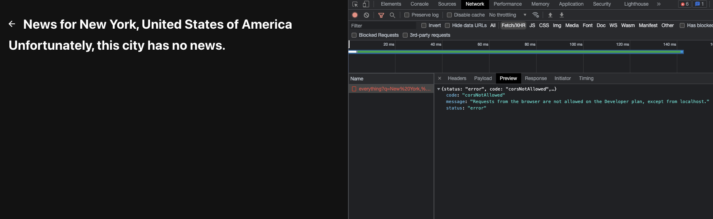

# Proiect Cloud Computing - Weather & News App

## Rulare

```bash
npm run dev
```

## Link-uri utile

GitHub: https://github.com/cc-stefan/cloud-computing-next

Vercel: https://cloud-computing-next.vercel.app/

Youtube: https://youtu.be/BDBde5WymPQ

## Cuprins

I. Introducere

II. Descriere tehnologii cloud folosite
1. Weather API (https://www.weatherapi.com/)
2. News API (https://newsapi.org/)

III. Capturi ecran aplicație
1. Pagina principală
2. Pagina de știri

IV. Publicarea aplicației

## I. Introducere

Aplicația Weather & News este o aplicație web care vă permite să căutați condițiile meteorologice actuale și știrile locale pentru orice oraș din lume. Cu un design simplu și ușor de folosit, aplicația oferă informații relevante despre vreme și știri într-un singur loc. 	Utilizatorii pot adăuga orașe într-o listă de locații salvate, pentru a reveni rapid la informațiile meteorologice și știrile pentru locurile preferate. Această aplicație este perfectă pentru persoanele care doresc să rămână la curent cu evenimentele locale și condițiile meteorologice în timp ce călătoresc sau pentru cei care doresc să urmărească vremea și știrile în mai multe locații.

## II. Descriere tehnologii cloud folosite

Aplicația Weather & News folosește două API-uri externe pentru a oferi informații despre vreme și știri pentru locațiile selectate de utilizatori. Aceste API-uri permit aplicației să furnizeze informații actualizate și relevante pentru utilizatori în timp real. Descrierea detaliată a API-urilor folosite este prezentată mai jos:

### 1. Weather API (https://www.weatherapi.com/)

API-ul Weather este folosit pentru a obține informații despre condițiile meteorologice actuale pentru locația căutată de utilizator. Acest API furnizează date despre temperatura curentă, descrierea vremii, viteza vântului, umiditatea și alte detalii relevante.

Pentru a utiliza acest API, aplicația efectuează o solicitare GET către un endpoint specific, furnizând un query parameter care conține numele orașului și cheia API. Răspunsul primit este un obiect JSON care conține informații despre vremea curentă pentru locația respectivă.

API-ul Weather este esențial pentru aplicația noastră, deoarece furnizează datele necesare pentru a afișa condițiile meteorologice actuale pentru fiecare locație căutată de utilizatori.

Exemplu request & response Weather API






### 2. News API (https://newsapi.org/)

API-ul News este folosit pentru a obține cele mai recente știri locale pentru locațiile selectate de utilizatori. Acest API furnizează titlurile știrilor, descrierea, link-ul către articolul complet și imaginea asociată cu știrea.

Pentru a utiliza acest API, aplicația efectuează o solicitare GET către un endpoint specific, furnizând un query parameter care conține numele orașului și cheia API. Răspunsul primit este un obiect JSON care conține o listă de articole de știri pentru locația respectivă.

API-ul News este important pentru aplicația noastră, deoarece permite utilizatorilor să rămână informați despre evenimentele și știrile locale din locațiile selectate.

Prin utilizarea acestor API-uri externe, aplicația Weather & News este capabilă să ofere informații actualizate și relevante despre vreme și știri pentru utilizatori într-un mod rapid și eficient. Integrarea acestor API-uri asigură o experiență de utilizator bogată și interesantă, precum și o funcționalitate extinsă a aplicației.

Exemplu request & response News API



## III. Capturi ecran aplicație

### 1. Pagina principală

Pagina principală a aplicației este concepută pentru a le permite utilizatorilor să caute informații meteorologice și știri locale pentru diferite locații. La accesarea paginii principale, utilizatorul va întâmpina următoarele elemente:

•	Un câmp de căutare - Acest câmp permite utilizatorilor să introducă numele locației pentru care doresc să afle informații meteorologice și știri locale. Utilizatorul poate introduce numele orașului, codul poștal sau coordonatele geografice.

•	Un buton de căutare - După ce utilizatorul introduce o locație în câmpul de căutare, apăsând pe butonul de căutare se vor prelua și afișa informațiile meteo și știrile locale pentru locația respectivă.

•	Tabelul cu locațiile căutate - După efectuarea unei căutări, locația va fi salvată în baza de date și va apărea în tabelul cu locațiile căutate. Tabelul va conține informații precum numele locației, condițiile meteorologice, temperatura și opțiuni pentru ștergere sau vizualizarea știrilor locale.

•	Un buton de actualizare - Acest buton permite utilizatorilor să actualizeze manual tabelul cu locațiile căutate, reflectând modificările recente sau adăugările de locații noi.



### 2. Pagina de știri

   Pagina de știri a aplicației este dedicată prezentării știrilor relevante pentru o anumită locație. Utilizatorii pot accesa această pagină direct din lista de locații căutate de pe pagina principală, apăsând pe butonul de știri corespunzător fiecărei locații. Odată ajunși pe pagina de știri, utilizatorii vor întâmpina următoarele elemente:

•	Un titlu descriptiv - Acesta indică numele locației pentru care sunt afișate știrile și servește drept reper pentru a se asigura că utilizatorul vizualizează știrile corecte.

•	O serie de carduri de știri - Aceste carduri prezintă știrile locale relevante pentru locația aleasă. Fiecare card conține un titlu, o imagine (dacă este disponibilă), un rezumat al știrii și o sursă. Toate cardurile sunt de aceeași înălțime și rezumatele care depășesc o anumită lungime sunt trunchiate cu trei puncte de suspensie.

•	Linkuri către articolele de știri - Fiecare card de știri este clickable, iar la selectarea unui card, utilizatorul va fi redirecționat către pagina web care conține articolul complet.

•	Un buton de întoarcere - Acest buton permite utilizatorilor să se întoarcă la pagina principală a aplicației, facilitând navigarea și explorarea altor locații sau știri.



## IV. Publicarea aplicației

Aplicația Weather & News a fost publicată folosind platforma Vercel, care oferă un serviciu de hosting rapid și ușor de utilizat pentru aplicațiile Next.js. Puteți accesa aplicația la următorul link: https://cloud-computing-next.vercel.app/.



Este important de menționat că, din păcate, în cazul unei aplicații publicate, API-ul News nu funcționează pentru utilizatorii care beneficiază de un plan gratuit. Acesta funcționează doar pentru utilizatorii care au un plan plătit. Această limitare este impusă de furnizorul API-ului News și nu poate fi ocolită prin modificări ale aplicației.


